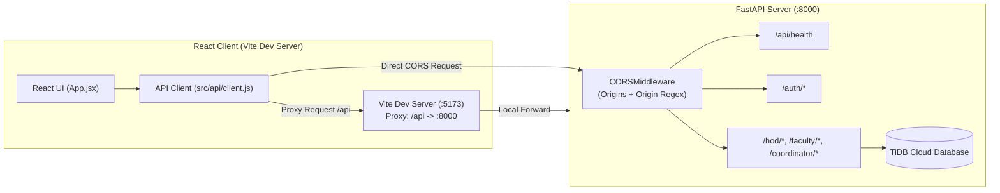

# Frontend & Backend Integration Documentation

**Project:** OBE (Outcome Based Education) Tracking System  
**Date:** September 2026  
**Document Location:** `backend/documentation/FRONTEND_BACKEND_INTEGRATION.md`  

---

## 1. Executive Summary

This document details the configuration and end-to-end integration between the **React JavaScript Frontend** and the **FastAPI Backend**, including:
- Frontend initialization with Vite and Oxlint
- Cross-Origin Resource Sharing (CORS) architecture in FastAPI
- Vite development server proxy setup
- Unified frontend API client and health check monitoring
- Testing and verification results

---

## 2. Architecture Overview



---

## 3. Frontend Implementation

### 3.1 Framework & Tooling Setup
- **Framework:** React 19 (JavaScript)
- **Bundler / Dev Server:** Vite 8.2.2
- **Linter:** [Oxlint](https://oxc.rs/) (`oxlint` v1.79+)
- **Location:** `c:\Users\Eshaan\Outcome_Based_Education\frontend`

### 3.2 Linter Configuration (`.oxlintrc.json`)
The frontend uses Oxlint for high-performance static analysis and linting:
```json
{
  "$schema": "./node_modules/oxlint/configuration_schema.json",
  "plugins": ["react", "oxc"],
  "rules": {
    "react/rules-of-hooks": "error",
    "react/only-export-components": ["warn", { "allowConstantExport": true }]
  }
}
```
Linter command:
```bash
npm run lint
```
*Current status: 0 errors, 0 warnings across all source files.*

### 3.3 Vite Dev Server & Proxy Configuration (`vite.config.js`)
Configured to serve on port `5173` and proxy `/api` requests to the FastAPI backend:
```javascript
import { defineConfig } from 'vite'
import react from '@vitejs/plugin-react'

export default defineConfig({
  plugins: [react()],
  server: {
    port: 5173,
    proxy: {
      '/api': {
        target: 'http://127.0.0.1:8000',
        changeOrigin: true,
      },
    },
  },
})
```

### 3.4 Environment Variables (`frontend/.env`)
```env
VITE_API_BASE_URL=http://127.0.0.1:8000
```

### 3.5 API Client Service (`frontend/src/api/client.js`)
Provides resilience with both direct URL calls and fallback proxy endpoints:
```javascript
const API_BASE_URL = import.meta.env.VITE_API_BASE_URL || 'http://127.0.0.1:8000';

export async function checkBackendHealth() {
  const endpoints = [
    `${API_BASE_URL}/api/health`,
    `${API_BASE_URL}/`,
    '/api/health',
  ];

  let lastError = null;

  for (const url of endpoints) {
    try {
      const response = await fetch(url, {
        method: 'GET',
        headers: { 'Accept': 'application/json' },
      });

      if (response.ok) {
        const data = await response.json();
        return { success: true, endpoint: url, data };
      }
    } catch (err) {
      lastError = err;
    }
  }

  return {
    success: false,
    error: lastError ? lastError.message : 'Unable to connect to backend server',
  };
}

export { API_BASE_URL };
```

---

## 4. Backend CORS & Health Endpoint Implementation

### 4.1 CORS Middleware (`backend/main/main.py`)
FastAPI was updated with `CORSMiddleware` to authorize requests across web origins and prevent browser CORS blocks:

```python
from fastapi.middleware.cors import CORSMiddleware

origins = [
    "http://localhost:5173",
    "http://127.0.0.1:5173",
    "http://localhost:3000",
    "http://127.0.0.1:3000",
    "http://localhost:4173",
    "http://127.0.0.1:4173",
]

app.add_middleware(
    CORSMiddleware,
    allow_origins=origins,
    allow_origin_regex=r"^https?://(localhost|127\.0\.0\.1)(:\d+)?$",
    allow_credentials=True,
    allow_methods=["*"],
    allow_headers=["*"],
)
```

**Key Highlights:**
- **`allow_origins`**: Explicitly whitelists the primary Vite dev ports (`5173`, `3000`, `4173`).
- **`allow_origin_regex`**: Dynamically matches any port on `localhost` and `127.0.0.1` so alternative dev ports are never blocked.
- **`allow_credentials=True`**: Allows cookies and Authorization headers to pass securely.
- **`allow_methods=["*"]` & `allow_headers=["*"]`**: Grants full support for `GET`, `POST`, `PUT`, `DELETE`, `PATCH`, and custom headers like `Authorization` and `Content-Type`.

### 4.2 Health Check Endpoint
A dedicated `/api/health` route allows instant client and infrastructure health monitoring:
```python
@app.get("/api/health", tags=["Health"])
def health_check():
    return {"status": "ok", "message": "OBE Tracking System API is running"}
```

---

## 5. End-to-End Verification Matrix

| Test Case | Method / URL | Origin / Headers | Expected Result | Actual Status |
|---|---|---|---|---|
| **Vite Web App** | `GET http://127.0.0.1:5173/` | - | Returns 200 with React HTML | **PASS (200 OK)** |
| **Vite Proxy** | `GET http://127.0.0.1:5173/api/health` | Proxied to `:8000` | Returns 200 with JSON payload | **PASS (200 OK)** |
| **Direct CORS Request** | `GET http://127.0.0.1:8000/api/health` | `Origin: http://localhost:5173` | Returns `access-control-allow-origin: http://localhost:5173` | **PASS (200 OK)** |
| **Preflight Request** | `OPTIONS http://127.0.0.1:8000/auth/login` | `Origin: http://localhost:5173`, Method: `POST` | Returns 200 with Allowed Methods/Headers | **PASS (200 OK)** |
| **Code Quality** | `npm run lint` | - | Oxlint static analysis passes cleanly | **PASS (0 errors, 0 warnings)** |

---

## 6. How to Run the Applications

### 6.1 Starting the Backend API
From the root workspace directory:
```bash
cd backend
..\venv\Scripts\uvicorn.exe main.main:app --reload --host 127.0.0.1 --port 8000
```
- API Base: `http://127.0.0.1:8000`
- Interactive Swagger Documentation: `http://127.0.0.1:8000/docs`
- ReDoc Documentation: `http://127.0.0.1:8000/redoc`

### 6.2 Starting the Frontend Client
From the root workspace directory:
```bash
cd frontend
npm run dev
```
- Client URL: `http://127.0.0.1:5173`
- Run Linter: `npm run lint`
- Build for Production: `npm run build`
